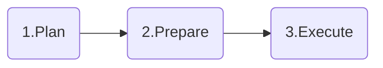

# Databricks to Microsoft Fabric Migration Patterns

This folder contains comprehensive templates and patterns to guide organizations through successful migrations from **Azure Databricks to Microsoft Fabric**. These resources provide structured methodologies, pre-built templates, and best practices to ensure smooth transitions while preserving data integrity and business continuity.

## Overview

Migrating from Azure Databricks to Microsoft Fabric requires careful planning, structured execution, and the right set of templates to ensure success. 

> **💡 Proven Impact**: These templates are based on real-world migrations that achieved >20% time & effort savings through structured automation and standardized processes.

## 📁 Available Templates

### 🏗️ Architecture & Planning Templates

| Template | Description | Use Case |
|----------|-------------|----------|
| **[Template_Architecture.pptx](./Templates/Template_Architecture.pptx)** | Comprehensive architecture design template for Databricks to Fabric migration | Design target state architecture, data flow diagrams, and technical blueprints |
| **[Template_ScopeAndRoadmap.pptx](./Templates/Template_ScopeAndRoadmap.pptx)** | Project scope definition and migration roadmap planning template | Define migration scope, phases, timelines, and strategic roadmap |
| **[Template_ExecutionTracker.xlsx](./Templates/Template_ExecutionTracker.xlsx)** | Project tracking and milestone management template | Monitor migration progress, deliverables, and timeline adherence |
| **[Template_InfraReadiness.xlsx](./Templates/Template_InfraReadiness.xlsx)** | Infrastructure readiness checklist and configuration guide | Ensure technical prerequisites and Fabric workspace setup |
| **[Template_ResourceReadiness.xlsx](./Templates/Template_ResourceReadiness.xlsx)** | Resource planning and team structure template | Organize human resources, roles, and responsibilities |

### 📊 Data Architecture Templates

| Template | Description | Use Case |
|----------|-------------|----------|
| **[Template_SourceToTargetMapping.xlsx](./Templates/Template_SourceToTargetMapping.xlsx)** | Comprehensive source-to-target mapping documentation | Map Databricks assets to Fabric equivalents, track dependencies |
| **[Template_FolderStructure_AzureDataLake.xlsx](./Templates/Template_FolderStructure_AzureDataLake.xlsx)** | Azure Data Lake folder structure and organization template | Organize data lake structure for optimal Fabric integration |
| **[Template_FolderStructure_FabricWorkspace.xlsx](./Templates/Template_FolderStructure_FabricWorkspace.xlsx)** | Microsoft Fabric workspace organization template | Structure Fabric workspace for optimal organization and governance |
| **[Template_FolderStructure_SynapseWorkspace.xlsx](./Templates/Template_FolderStructure_SynapseWorkspace.xlsx)** | Synapse workspace structure template (for hybrid scenarios) | Organize Synapse components in hybrid Fabric deployments |

### 💻 Code Templates

| Template | Description | Use Case |
|----------|-------------|----------|
| **[Template_SparkNotebook.ipynb](./Templates/Template_SparkNotebook.ipynb)** | Standardized Spark notebook template for Fabric | Create consistent, well-documented notebooks following best practices |

## 🚀 Getting Started

### Prerequisites

Before using these templates, ensure you have:

- **Azure Subscription**: With appropriate permissions for Fabric and Data Lake
- **Microsoft Fabric Workspace**: Provisioned and configured
- **Databricks Assessment**: Complete inventory of existing assets
- **Migration Plan**: High-level migration strategy and timeline

### Usage Workflow

1. **Planning Phase**
   - Start with `Template_Architecture.pptx` to design your target state
   - Define project scope and roadmap using `Template_ScopeAndRoadmap.pptx`
   - Use `Template_ExecutionTracker.xlsx` to plan project deliverables and related milestones
   - Configure team structure with `Template_ResourceReadiness.xlsx`

2. **Preparation Phase**
   - Assess infrastructure readiness using `Template_InfraReadiness.xlsx`
   - Map all assets using `Template_SourceToTargetMapping.xlsx`
   - Organize folder structures using the respective templates
   - Configure automation tools for migration execution (see [Tools folder](../../Tools/README.md))

3. **Execution Phase**
   - Use `Template_SparkNotebook.ipynb` for standardized code development
   - Track progress with the execution tracker
   - Validate mappings and folder structures

## 📋 Migration Methodology

These templates support a **3-phase structured approach**:

### 1️⃣ Plan Phase
- Define migration scope and success criteria
- Design target architecture using architecture template
- Assess current assets and dependencies
- Create project timeline and resource allocation

### 2️⃣ Prepare Phase
- Set up Fabric workspace infrastructure
- Configure folder structures and organization
- Map source assets to target destinations
- Prepare team and processes

### 3️⃣ Execute Phase
- Migrate notebooks and data assets
- Validate data integrity and performance
- Deploy to production environment
- Decommission legacy Databricks resources

## 🛠️ Template Customization

### Architecture Template
- Customize reference architecture for your specific use case
- Add organization-specific compliance and security requirements
- Include integration patterns with existing systems

### Tracking Templates
- Modify milestone definitions based on project scope
- Add custom fields for organization-specific tracking needs
- Integrate with existing project management tools

### Folder Structure Templates
- Adapt naming conventions to organizational standards
- Include additional metadata and governance requirements
- Align with existing data classification schemes

## 🔗 Integration with Migration Tools

These templates work seamlessly with the Fabric Migration Factory automation tools:

- **[ADB to Fabric Converter](../../Tools/CodeTranslator/ADBtoSynapse/)**: Automated notebook conversion
- **[Data Reconciliation](../../Tools/DataReconciliation/AzureSQL/)**: Data validation and consistency checks
- **[Performance Testing](../../Tools/PerformaceTest/)**: Performance baseline and comparison analysis

## 📚 Best Practices

### Architecture Design
- Follow Microsoft Fabric security and governance best practices
- Design for scalability and future growth
- Include disaster recovery and backup strategies

### Project Management
- Use incremental migration approach with clear phases
- Maintain comprehensive documentation throughout
- Establish clear success criteria and validation checkpoints

### Resource Planning
- Include both technical and business stakeholders
- Plan for training and knowledge transfer
- Allocate sufficient time for testing and validation

## 🆘 Support and Troubleshooting

### Getting Help
- Create an issue in the [Fabric Migration Factory repository](https://github.com/microsoft/fabric-migrationfactory/issues)
- Review the main [project documentation](../../README.md)

## 🤝 Contributing
For contribution guidelines, see the main [project documentation](../../README.md#contributing).

---

**Note**: These templates represent proven patterns from successful migrations. Adapt them to your specific organizational needs, compliance requirements, and technical environments while you can maintain the core structural approach.