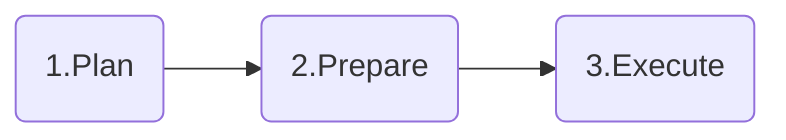

# Databricks to Microsoft Fabric Migration Pattern

This folder contains comprehensive templates and patterns to guide organizations through successful migrations from **Azure Databricks to Microsoft Fabric**. These resources provide structured methodologies, pre-built templates, and best practices to ensure smooth transitions while preserving data integrity and business continuity.

## Overview

Migrating from Azure Databricks to Microsoft Fabric requires careful planning, structured execution, and the right set of templates to ensure success. 

> **💡 Proven Impact**: These templates are based on real-world migrations that achieved >20% time & effort savings through structured automation and standardized processes.

## 🚀 Getting Started

### Prerequisites

**Before starting, ensure you have:**

- **Microsoft Fabric license** (Premium or Fabric capacity)
- **Admin access** to both Azure Databricks and ability to create Fabric workspaces
- **Downloaded templates** from the [`./Templates/`](./Templates/) folder

## 📋 Migration Steps

Follow this **3-phase structured approach** for successful Databricks to Fabric migration:

### 1️⃣ Plan Phase
**Define scope, architecture, and project structure**
- Design target state architecture using [`Template_Architecture.pptx`](./Templates/Template_Architecture.pptx)
- Define migration scope and roadmap with [`Template_ScopeAndRoadmap.pptx`](./Templates/Template_ScopeAndRoadmap.pptx)
- Plan project deliverables and milestones using [`Template_ExecutionTracker.xlsx`](./Templates/Template_ExecutionTracker.xlsx)
- Configure team structure with [`Template_ResourceReadiness.xlsx`](./Templates/Template_ResourceReadiness.xlsx)

### 2️⃣ Prepare Phase
**Set up infrastructure and map assets**
- Assess infrastructure readiness using [`Template_InfraReadiness.xlsx`](./Templates/Template_InfraReadiness.xlsx)
- Map all Databricks assets to Fabric equivalents with [`Template_SourceToTargetMapping.xlsx`](./Templates/Template_SourceToTargetMapping.xlsx)
- Organize folder structures using the respective templates ([Data Lake](./Templates/Template_FolderStructure_AzureDataLake.xlsx), [Fabric Workspace](./Templates/Template_FolderStructure_FabricWorkspace.xlsx))
- Configure automation tools to accelerate migration execution:
  - [ADB to Fabric Converter](../../Tools/CodeTranslator/ADBtoSynapse/README.md) - Automated notebook conversion
  - [Data Reconciliation](../../Tools/DataReconciliation/AzureSQL/README.md) - Data validation and consistency checks
  - [Performance Testing](../../Tools/PerformaceTest/AzureSQLvsFabricSQL/README.md) - Performance baseline and comparison analysis

### 3️⃣ Execute Phase
**Migrate, validate, and deploy**
- Convert notebooks using [`Template_SparkNotebook.ipynb`](./Templates/Template_SparkNotebook.ipynb) as the standard
- Migrate data assets and validate data integrity
- Track progress continuously with the execution tracker
- Deploy to production and decommission legacy Databricks resources

## � Best Practices

### 🏗️ Architecture & Design
- Follow Microsoft Fabric security and governance guidelines
- Design for scalability, future growth, and disaster recovery
- Include integration patterns with existing enterprise systems

### 📊 Project Management & Tracking
- Use incremental migration approach with clear phase gates
- Maintain comprehensive documentation throughout the process
- Establish measurable success criteria and validation checkpoints

### 📁 Organization & Structure
- Include both technical and business stakeholders in planning
- Plan for comprehensive training and knowledge transfer
- Allocate sufficient time for thorough testing and validation phases

## 🆘 Support and Troubleshooting

### Getting Help
- Create an issue in the [Fabric Migration Factory repository](https://github.com/microsoft/fabric-migrationfactory/issues)
- Review the main [project documentation](../../README.md)

## 🤝 Contributing
For contribution guidelines, see the main [project documentation](../../README.md#contributing).

---

**Note**: These templates represent proven patterns from successful migrations. Adapt them to your specific organizational needs, compliance requirements, and technical environments while maintaining the core structural approach.

**Template Customization**: All templates in the [`./Templates/`](./Templates/) folder can be customized for your organization's specific requirements. Modify the [`Template_Architecture.pptx`](./Templates/Template_Architecture.pptx) for your use case and compliance needs, adapt milestone definitions in [`Template_ExecutionTracker.xlsx`](./Templates/Template_ExecutionTracker.xlsx) based on project scope, customize folder naming conventions in structure templates to organizational standards, and integrate with your existing project management tools and governance frameworks as needed.