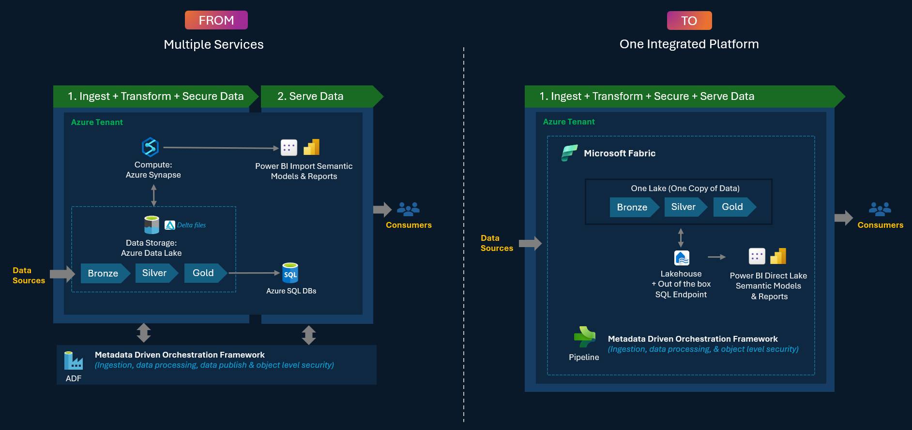

# Welcome to the Fabric Accelerate Factory

  

A comprehensive framework and toolkit designed to guide organizations through successful migrations from Azure Synapse Analytics and Power BI Import Model to Microsoft Fabric. This repository provides structured methodologies, automation tools, and best practices to ensure smooth transitions while preserving data integrity and business continuity.

This repository is brought to you by a Microsoft Internal BI Team and will continue to grow as we develop new tools and accelerators.

These assets should be treated as examples that you can use to create the solutions that are appropriate for your use case. If you have any issues, please use the [issues](https://github.com/microsoft/fabric-migrationfactory/issues) tab of this repository and we will work to address issues on a best effort basis.

## 🚀 Migration Scenarios

The Fabric Migration Factory supports comprehensive migration scenarios based on this high-level migration architecture:

*The following migration guides are designed around this architectural framework to ensure consistent, structured approaches to Microsoft Fabric adoption.*

### 1. ⚡ **Azure Synapse Spark → Microsoft Fabric**
Migrate your Synapse Spark workloads to Fabric Data Engineering with enhanced capabilities.

[**📖 View Complete Migration Guide**](./MigrationPatterns/Synapse_To_MSFabric/README.md)

**🛠️ Leverage Acceleration Tools:**
- [Data Reconciliation Toolkit](./Tools/DataReconciliation/AzureSQL/README.md) - Validate data consistency
- [SQL Performance Benchmarking](./Tools/PerformaceTest/AzureSQLvsFabricSQL/README.md) - Compare query performance

### 2. 📈 **Power BI Import Model → Direct Lake**
Modernize your Power BI semantic models for real-time analytics with Direct Lake connectivity.

[**📖 View Complete Migration Guide**](./MigrationPatterns/ImportModel_To_DirectLake/README.md)

**🛠️ Leverage Acceleration Tools:**
- [Semantic Model Translator](./Tools/CodeTranslator/SematicModelTranslator/README.md) - Automated model conversion
- [Power BI Performance Testing](./Tools/PerformaceTest/PowerBIVisuals/README.md) - Compare visual performance

# Contributing

This project welcomes contributions and suggestions. Most contributions require you to agree to a Contributor License Agreement (CLA) declaring that you have the right to, and actually do, grant us the rights to use your contribution. For details, visit https://cla.opensource.microsoft.com.

When you submit a pull request, a CLA bot will automatically determine whether you need to provide a CLA and decorate the PR appropriately (e.g., status check, comment). Simply follow the instructions provided by the bot. You will only need to do this once across all repos using our CLA.

This project has adopted the [Microsoft Open Source Code of Conduct](https://opensource.microsoft.com/codeofconduct/). For more information see the [Code of Conduct FAQ](https://opensource.microsoft.com/codeofconduct/faq/) or contact [opencode@microsoft.com](mailto:opencode@microsoft.com) with any additional questions or comments.

# Trademarks

This project may contain trademarks or logos for projects, products, or services. Authorized use of Microsoft trademarks or logos is subject to and must follow [Microsoft's Trademark & Brand Guidelines](https://www.microsoft.com/en-us/legal/intellectualproperty/trademarks/usage/general). Use of Microsoft trademarks or logos in modified versions of this project must not cause confusion or imply Microsoft sponsorship. Any use of third-party trademarks or logos are subject to those third-party's policies.
