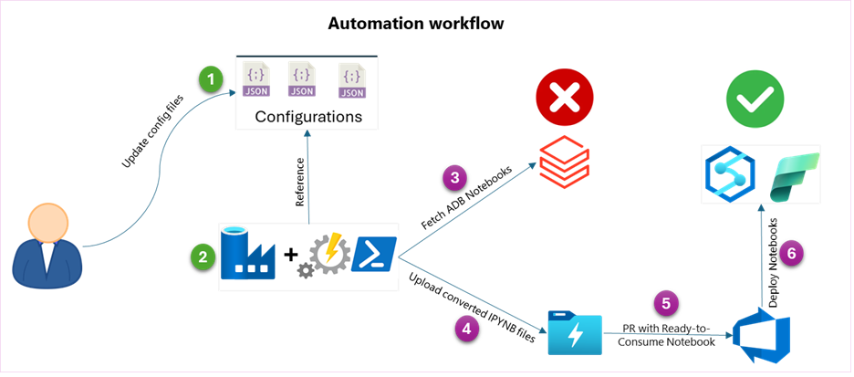
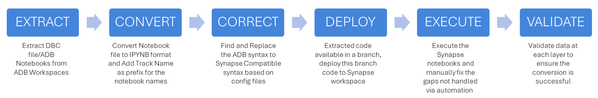
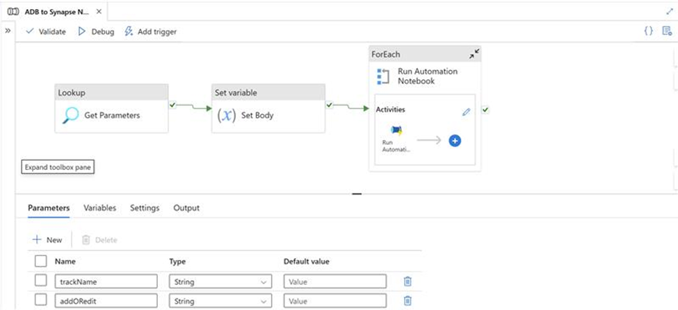

## Code Translator – ADB to Synapse

### Objective

The **Code Translator** tool is designed to programmatically convert PySpark and SQL-based notebooks from **Azure Databricks (ADB)** into **Azure Synapse**-compatible formats. This accelerates the code migration process, minimizes manual effort, and reduces human error through configuration-driven translation logic.

Key capabilities include:

- Automated conversion of PySpark and SQL cells into Synapse-supported code  
- Support for configurable folder structures to align with project standards  
- Automatic placement of translated code into Azure DevOps (ADO) repositories for seamless hand-off  
- Covers **40–60%** of code translation; remaining customizations can be completed manually

### Key Benefits

- 🚀 **Accelerates Migration** – Speeds up ADB-to-Synapse modernization by auto-translating notebooks  
- ⚙️ **Configuration-Driven Conversion** – Enables flexible mapping logic through YAML/config templates  
- 💻 **Reduces Manual Errors** – Eliminates tedious and error-prone copy-paste efforts  
- 📁 **Standardized Folder Output** – Generates clean, structured output aligned with enterprise practices  
- 🔄 **CI/CD-Ready Integration** – Pushes generated scripts directly to ADO repos for deployment pipelines  
- 🔍 **Partial Automation with Auditability** – Transparently shows what’s converted vs. what requires manual intervention

## Pre-requisites

To successfully run the **Code Translator – ADB to Synapse**, ensure the following components are in place:

- 🛠️ **ADF Pipeline**  
  Used to orchestrate and execute the runbooks that drive the translation process.

- 📁 **ADO DevOps Repository**  
  Destination for exporting the converted notebook code files for version control and CI/CD integration.

- ⚙️ **Configuration Files**  
  Key-value pair–based configuration files customized for each project. These control conditional logic and mapping rules during code translation.

- 🧠 **Azure Synapse Workspace**  
  Target environment where converted scripts will be published for use within Synapse pipelines or notebooks.

- 🧪 **Azure Databricks Workspace (ADB)**  
  Source environment from which PySpark and SQL notebooks will be extracted for translation.

- 🗂️ **Azure Data Lake Storage Gen2 (ADLS Gen2)**  
  Intermediate storage used for hosting runbooks, configuration files, and translated code artifacts.

## Key Components

- **`ADF pipeline`**  
  Orchestrates the end-to-end code conversion process, including extraction, translation, and export of final Synapse-compatible notebook files.

- **`Config files`**  
  Configuration items used to guide the notebook translation. These key-value pair files control folder mappings and syntax substitutions:

  - `ADBFolders_config.json`: Maps track names to their respective ADB folder structures for notebook extraction.  
  - `syntax_config.json`: Contains syntax transformation rules for converting ADB code to Synapse format.  
  - `folder_config.json`: Defines the folder structure for organizing converted code in Synapse.

- **`Runbooks`**  
  PowerShell scripts that orchestrate various stages of the code translation pipeline:

  - `Extract-ADBWorkspace-Notebooks`: Connects to the ADB production workspace and copies source notebooks to ADLS.  
  - `Convert-ADBtoSynapse-Format`: Translates ADB code into Synapse-compatible format using the config files.  
  - `ImportNotebooks-ADLSToADORepo`: Commits converted notebooks to a new `dev-migration` branch and creates a pull request in ADO.

- **`ADLS container`**  
  Hosts all configuration and runbook files. Also serves as temporary storage for both the original ADB notebooks and the translated Synapse-compatible output.

- **`DevOps Repo`**  
  Git repository and associated branch used to store translated notebooks for deployment into the Synapse workspace via CI/CD.

## How to Run

### Step 0: Initial Setup
- Clone the folder locally to download the Tool’s components.
- Configure Runbook and Config files and upload them into the ADLS container.
- Set up the ADF pipeline using the provided ARM template.
- Configure required Linked Services for pipeline execution.
- Update notebook-specific config key-value pairs as needed.
- Set up a Git branch where the converted output will be exported.

### Step 1: Run the ADF Pipeline
- Trigger the ADF pipeline using the following parameters:
  - `trackName`: The track for which notebooks need to be converted.
  - `addORedit`: Use `add` if notebooks are being added for the first time. Use `edit` if notebooks already exist in the branch.

> The pipeline sequentially runs the following runbooks:
> 1. Extract Runbook  
> 2. Convert Runbook  
> 3. Import Runbook

This process creates a Pull Request (PR) to the configured `dev-migration` branch. The PR can be reviewed and merged into the repository.

### Step 2: Review and Refine
- After successful pipeline execution, the converted code appears in the configured Git branch.
- Review and validate the changes. If adjustments are needed, update the config files and re-run Step 1.

### Step 3: Deploy to Synapse
- Deploy the converted `.ipynb` files to the Synapse workspace.
- Assign appropriate Spark Pools and execute the notebooks.

### Step 4: Manual Review (If Needed)
- If a notebook cannot be fully converted to Synapse-compatible format, perform a manual review and apply necessary code changes.
