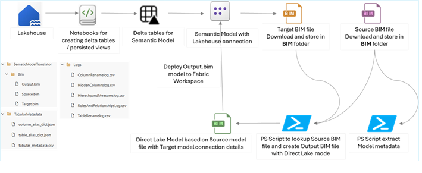

## Code Translator – Semantic Model Translator

### Objective

The **Import to Direct Lake Migration Automation Tool** streamlines the conversion of Power BI **Import Mode** semantic models into **Microsoft Fabric Direct Lake** models.

This tool automates:

- Extraction of metadata from **source** and **target** `.bim` files
- Mapping via standardized **CSV config files**
- Merging and generation of a new **Direct Lake model** `.bim` file
- Deployment to Microsoft Fabric workspace
- Audit and reconciliation logs for transparency

It delivers up to **~40% effort savings** and helps enforce model consistency across workspaces.

---

### Architecture & Workflow

**Process Flow (based on image above):**

1. **Lakehouse Layer:**  
   Notebooks create **Delta tables** or **persisted views** for the semantic model.

2. **Model Construction:**  
   A semantic model is created with **Lakehouse connection** and exported as a `.bim` file.

3. **Source & Target Model Collection:**  
   - PowerShell scripts download **source** and **target** `.bim` files and store them in the `BIM` folder.
   - Metadata (tables, columns, roles) is extracted from the source model.

4. **Transformation:**  
   - PowerShell script generates a new `Output.bim` using source structure and target connection details.
   - Uses config files for:
     - Column renaming
     - Hidden column management
     - Role mappings
     - Hierarchy/measure rewiring

5. **Deployment:**  
   The resulting `Output.bim` file is deployed to the Fabric workspace.

6. **Manual Updates:**  
   Once output model file is uploaded to Fabric Workspace, make sure to perform checks & validations for the gaps and implement the changes manually. Changes varyies from Model to Model hence this needs to be validated manually.
---

### Key Benefits

- 💡 **~40% reduction** in dataset migration effort  
- 🧪 **40+ models migrated** in Wave 1 & 2  
- 📋 **Auto-generated CSV logs** for:
  - Column renaming  
  - Hidden columns  
  - Hierarchies and measures  
  - Role & Relationships 
  - Table renaming

---

### Limitations

Manual effort is required in the following scenarios:

- ❌ **Calculated Columns**
- ❌ **Calculated Tables**
- ❌ **Static Tables**
- 🔐 Certain **role types** need to be manually recreated
- 🆔 **Naming constraints**: Table/column names must match exactly across source and target
- 🆔 **Column DataType constraints**: Column Data Type should be consistent between Source and Target model to ensure correct relationship implementation

---

### Prerequisites

- ✅ **Microsoft Fabric Workspace** – Used to host and manage Semantic models, Lakehouse, etc.
- 🏠 **Lakehouse** with shortcut tables already defined  
- 📛 **Matching table/column names** in both semantic models  
- 🧰 **Tabular Editor v2.24.1**  
- ⚙️ **PowerShell environment**

## How to Run

### Step 0: Initial Setup
- Clone the folder locally to download the Tool’s components.
- Create Lakehosue with shortcuts and views require for the semantic model
- PowerShell Editor to run the PowerShell scripts

### Step 1: Create a blank Semantic model based on Fabric Lakehouse
- Connect to Fabric Workspace, goto the Lakeshouse hosting the views for the semantic models.
- Then click on **New Semantic Model** and select the delta tables which are require for DL Semantic model.
- Connect to the Fabric workspace in Tabular Editor, and browse to the DL semantic model created (Target) and save it as "Target.bim" file.

### Step 2: Create source semantic model (bim) file for the existing Import mode model
- In Tabular Editor, connect to the PowerBI workspace where Import Mode model is published, and save the model as "Source.bim" file

### Step 3: Configure Tools folder and PowerShell scripts
- Goto cloned folder, under **Bim** folder upload both Source.bim and Target.bim file generated in previous step.
- Update **01.TabularMetadataExtractor.ps1** file at line **#31** for the Model schema as per the existing Import Mode model.
- Update **01.TabularMetadataExtractor.ps1** file at line **#33** for any prefix changes which you expect for e.g. in default code we are removing vw from the source semantic model to map with Fabric Lakehosue delta tables.

### Step 4: Execute the PowerShell files and Validate the **Output.bim** file and deploy to Fabric workspace
- Execute PowerShell files in sequence:
   - 01.TabularMetadataExtractor.ps1
   - 02.CopyMetadataFromSourceToTarget.ps1
- Post successful execution of these 2 scripts you will get a third Bim file in **Bim** folder named **Output.Bim**.
- Validate this bim file to check if settings and changes are implemented as per the Direct Lake Model.
- Connect to Fabric Workspace in Tabular Editor and open **Output.bim** file, then Deploy this model to Fabric workspace.

### Step 5: Perform manual validation on the DL model and update for the gaps related to Calculated Columns/tables, static tables, etc.
- Once the final model file (Direct Lake) is available in Fabric Workspace, validate the model and apply require fixes related to gaps (calculated columns/tables, Static Tables, any roles or Relationship missing, etc.)