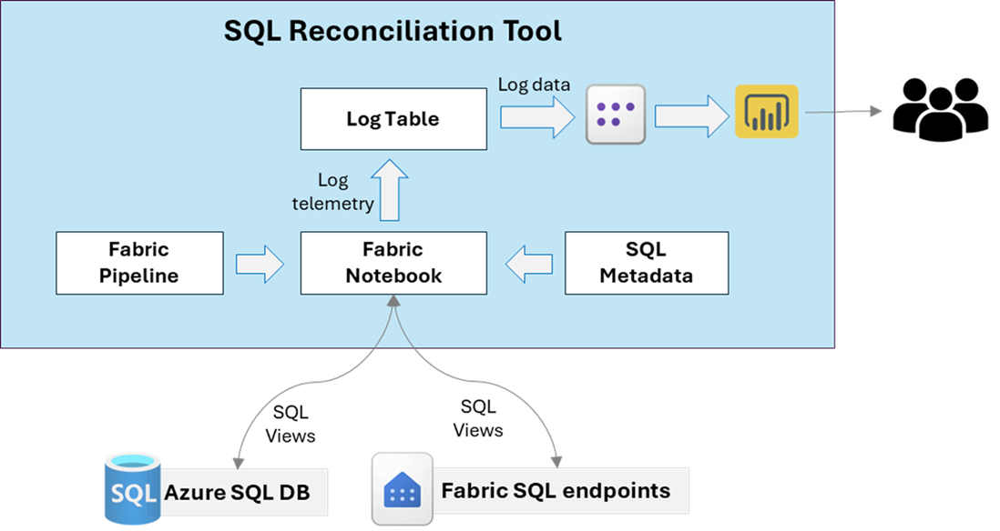
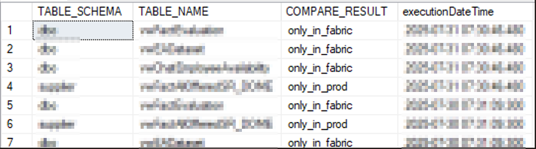
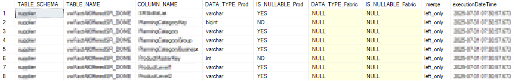
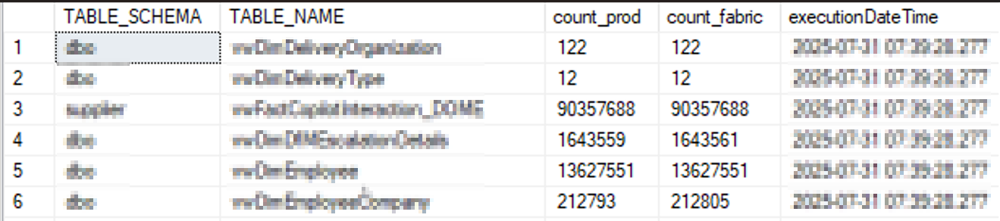
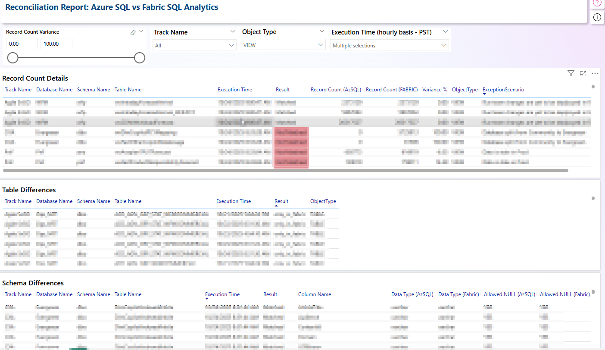

## SQL Reconciliation Tool

### Objective

The **SQL Reconciliation Tool** is designed to compare two Azure SQL databases—typically a **source** and **target**—to validate structural and data consistency as part of data migration or quality assurance initiatives. The tool performs automated checks across the following dimensions:

1. **Table and View Existence** – Verifies presence of tables/views across both environments  
2. **Schema Differences** – Compares column definitions, data types, and nullability  
3. **Record Counts** – Evaluates row count differences for common tables  
4. **Null Checks** – Identifies missing values in business-critical columns

### Solution Design Diagram 



### Key Benefits

- ⚙️ **Fully Automated Comparison** – No manual effort required; daily execution supported  
- 📊 **Multi-Level Validation** – Structural, volumetric, and content-level checks included  
- 🚨 **Discrepancy Alerts** – Highlights differences in schema, missing tables, and record mismatches  
- 🔁 **Supports Azure SQL and Fabric SQL Analytics Endpoints**  
- 📅 **Enables Daily Reconciliation Reports** – Essential for migration cutover tracking and audit trails


## Pre-requisites

To execute the **SQL Reconciliation Tool**, ensure the following prerequisites are configured and available:

### Environment Setup

- ✅ **Microsoft Fabric Workspace** – Used to host and manage tool components  
- 🗂️ **SQL Database (Source & Target)** – Required for comparing databases for reconciliation 
- 🧮 **SQL DB** – Metadata tables used for log and model tracking  
- 📊 **Power BI Semantic Models** – Both *Import Mode* and *Direct Lake* models should be available for performance comparison  

### Python Environment

Ensure the following Python libraries and modules are available in the execution environment (e.g., notebook, script runner):

| Component | Version | Purpose |
|-----------|---------|---------|
| Python | 3.7+ | Core runtime |
| PySpark | Latest | Distributed data processing |
| Requests | Latest | HTTP API calls |
| Pandas | Latest | Data manipulation |
| Power BI REST API | v1.0 | Dataset and report access |
| Microsoft Fabric | Current | Data platform integration |

### Key Components

- **`run_reconciliation.ipynb`** - Core automation tool/script inlcuding metadata and connection details entry
- **`utility_reconciliation.ipynb`** - Utility functions require for exeuction of this tool
- **`ReconciliationReport.pbix`** - Pre-built SQL Reconciliation Record count analysis report


## How to Run

### Step 0: Initial Setup
- Clone the folder locally to download the Tool’s components.
- Configure Power BI Dataset and Report into your Fabric workspace.
- Upload all Python notebooks into the Fabric workspace.

### Step 1: Setting up metadata and connection details.
- Execute reconciliation.ipynb notebook, this will take care of:
    - Creating metadata and logging tables and views in SQL Database.
    - Inserting the connection metadata based on Dictionary cell, update Dictionary cell as per the requirement.
    - running the comparision

### Step 2: Execute reconciliation Notebook
Open `run_reconciliation.ipynb` and update:

```
    - Metadata SQL Server and Database Name
    - Source SQL Server and Database Name
    - Target SQL Server and Database Name
```
### Step 3: Execute Reconciliation Notebook
- Run the notebook to generate reconciliation logs.
- Verify the log with following queries:

###1: Table Differnce
select * from logging.tbl_Reconciliation_TableDiff order by executionDateTime desc
####Sample Output


###2: Schema Differnce
select * from logging.tbl_Reconciliation_SchemaDiff order by executionDateTime desc
####Sample Output


###3: Record Count differences
select * from logging.tbl_Reconciliation_RecordCountsDiff order by executionDateTime desc
####Sample Output



### Step 4: Configure Semantic Model and Power BI Report
- Open ReconciliationReport.pbix file in Power BI Desktop, it will prompt for entering the Config SQL database details.
- Enter Server and Database details and auth accordingly and test the connectivity.
- Report will show the schema and visuals, and post execution of run notebook, logging table will get populated.

### Step 5: Analyze in Power BI Report
- Open the Power BI report configured earlier.
- Refresh the dataset to load the latest log data and begin analysis.

