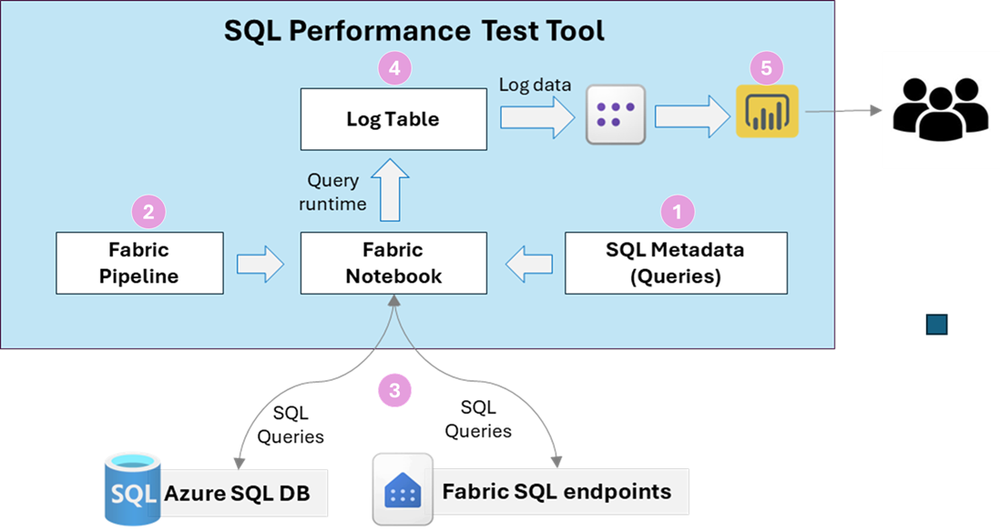
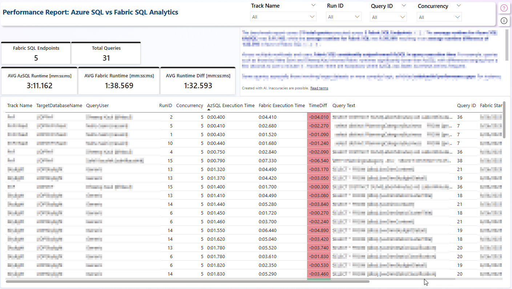
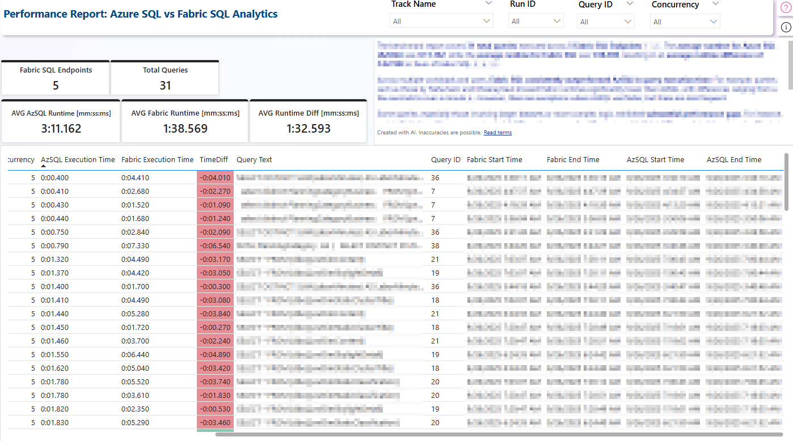

## SQL Performance Test Tool

### Objective

The **SQL Performance Test Tool** is designed to compare two Azure SQL databases like Azure SQL DB vs Fabric SQL Endpoint or two Azure SQL DBs or two Fabric SQL endpoints depends on usecases, typically a **source** and **target**—to assess the Query runtime performance 
### Solution Design Diagram 

### Key Benefits

⚖️ Capture runtimes (ASQL vs Fabric SQL)
-Sequential Test
-Concurrent Test  
📊 Visualize in Power BI – 
✅ Certify good performers
🚩 Flag slow queries

## Pre-requisites

To execute the **SQL Performance Test Tool**, ensure the following prerequisites are configured and available:

### Environment Setup

- ✅ **Microsoft Fabric Workspace** – Used to host and manage tool components  
- 🗂️ **SQL Database/Fabric SQL endpont (Source & Target)** – Required for comparing databases  
- 🧮 **SQL DB** – Metadata tables used for log and model tracking  
- 📊 **Power BI Semantic Models** – Both *Import Mode* and *Direct Lake* models should be available for performance comparison  

### Python Environment

Ensure the following Python libraries and modules are available in the execution environment (e.g., notebook, script runner):

| Component | Version | Purpose |
|-----------|---------|---------|
| Python | 3.7+ | Core runtime |
| PySpark | Latest | Distributed data processing |
| Requests | Latest | HTTP API calls |
| Pandas | Latest | Data manipulation |
| Power BI REST API | v1.0 | Dataset and report access |
| Microsoft Fabric | Current | Data platform integration |

### Key Components

- **`run_fabricsqlbenchmark.ipynb`** - Main execution script handler to perform Benchmark testing along with config DB object creation, Source/Target Connection details entry.
- **`utility_benchmark.ipynb`** - Contain all utility functions and Dictionaries for Metadata db objects and Connection details require for execution of main benchmark code.
- **`SQL Performance Benchmark Report.pbix`** - Pre-built SQL Query Performance runtime analysis report

## How to Run

### Step 0: Initial Setup
- Clone the folder locally to download the Tool’s components.
- Configure Power BI Dataset and Report into your Fabric workspace.
- Upload all Python notebooks into the Fabric workspace.

### Step 1: Update connection details dictionary for the require source and targe connection details.
- Update Source and Targe connection details in utility_benchmark file.

### Step 2: Update config server name and database names
- In run_fabricsqlbenchmark.ipynb file, update config ServerName, DatabaseName and Track Name details.

### Step 3: Run `run_fabricsqlbenchmark.ipynb` notebook:
- Execution of this notebook, will create metadata tables/views and insert Connection details in metadata.SPT_ConnectionDetails table, then executes the benchmark testing based on the Query entries in [metadata].[SPT_QueryCollection] table.

### Step 4: Ensure the entries are updated in [metadata].[SPT_QueryCollection] table for all the benchmark querie.
- Insert metadata for Query benchmark test execution, including the Query details and its owner.

### Step 5: Configure Semantic Model and Power BI Report
- Open SQL Performance Benchmark Report.pbix file in Power BI Desktop, it will prompt for entering the Config SQL database details.
- Enter Server and Database details and auth accordingly and test the connectivity.
- Report will show the schema and visuals, and post execution of run notebook, logging table will get populated.

### Step 6: Analyze in Power BI Report
- Open the Power BI report configured above.
- Refresh the dataset to load the latest log data and begin analysis.

