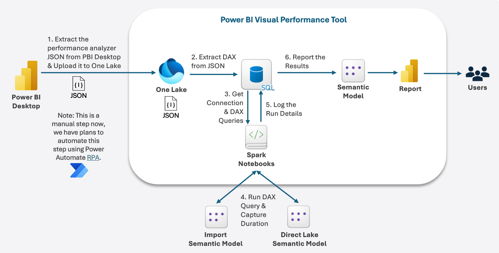
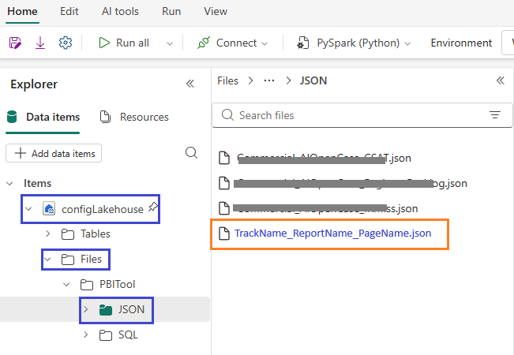
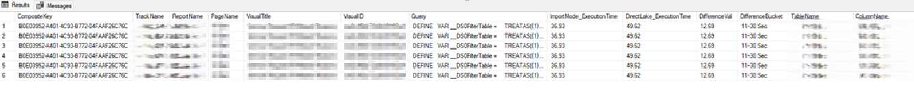
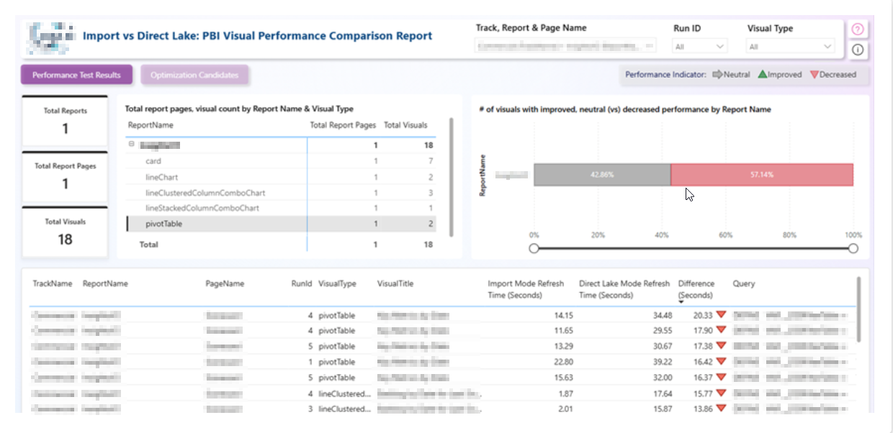
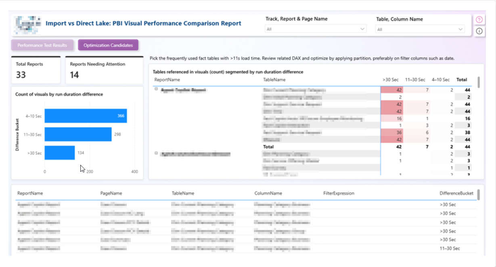

# Power BI Visual Performance Tool

## Objective

The **Power BI Visual Performance Tool** is designed to evaluate and compare report performance across two different versions of Power BI semantic models. This comparison can include:

- **Direct Lake vs Import Mode**  
- **Direct Lake vs Direct Lake**  
- **Import Mode vs Import Mode**

The tool automates the execution of a predefined set of DAX queries against both the source and target semantic models. It captures and logs key execution metrics, including:

- Query execution time  
- Success/failure status  
- Timestamp of execution  
- Report metadata (Track, Report Name, Page, Visual Title)

A companion Power BI report analyzes the captured logs and provides visual comparisons and insights such as:

- Visual-level performance delta (Improved vs Degraded)  
- Execution time difference  
- Historical run comparisons  
- Optimization candidate visuals grouped by execution time thresholds (e.g., 4–10s, 11–30s, >30s)

This tool helps teams:

- Identify visuals or models that may benefit from migration to Import Mode for better performance  
- Validate and benchmark performance improvements or regressions due to model changes or new feature rollouts

## Key Benefits
- Eliminate **90%+ of manual effort (saves 300+ hours)** in Power BI visual performance testing across **100+ Power BI Reports**. It instantly flags slow visuals and root-cause tables - driving faster optimization, improved report
  performance, and scalable BI operations.
- 📊 **Quantifiable Visual-Level Insights**: Easily identify slow-performing visuals with precise execution time breakdowns  
- ⚙️ **Automation-Driven Evaluation**: Eliminates manual DAX testing by automatically running predefined queries across environments  
- 🔁 **Repeatable Benchmarking**: Supports multiple test runs for historical comparison and tracking of performance trends  
- 🚀 **Optimization Decision Support**: Recommends visuals/models for optimization based on execution time thresholds  
- 🧪 **Feature Launch Testing**: Supports performance regression testing after changes or feature rollouts



## Pre-requisites

To execute the **Power BI Visual Performance Tool**, ensure the following prerequisites are configured and available:

### Environment Setup

- ✅ **Microsoft Fabric Workspace** – Used to host and manage tool components  
- 🗂️ **Fabric Lakehouse** – Required for uploading and storing raw JSON files  
- 🧮 **Fabric SQL Database** – Metadata tables used for log and model tracking  
- 📊 **Power BI Semantic Models** – Both *Import Mode* and *Direct Lake* models should be available for performance comparison  

### Python Environment

Ensure the following Python libraries and modules are available in the execution environment (e.g., notebook, script runner):

| Component | Version | Purpose |
|-----------|---------|---------|
| Python | 3.7+ | Core runtime |
| PySpark | Latest | Distributed data processing |
| Requests | Latest | HTTP API calls |
| Pandas | Latest | Data manipulation |
| Power BI REST API | v1.0 | Dataset and report access |
| Microsoft Fabric | F Capacity | Tool Integration & Execution |

### Key Components

- **`SQL Scripts`** - Scripts to create metadata and logging tables and views required for the tool
- **`Report JSON file`** - Power BI report JSON files that captures metadata about visuals, layout, and embedded DAX queries (via Performance Analyzer export), used by the tool to drive performance extraction and analysis.
- **`config_utility.ipynb`** - Centralized reusable components of the Performance Tool—such as configuration loaders, SQL helpers, data conversion utilities, logging, and more.
- **`config.ipynb`** - For metadata setup, inserting metadata entries, managing connection details, and configuring all settings required to run the Performance Tool.
- **`run.ipynb`** - The main driver notebook that executes the performance tool for a specific report, orchestrating metadata ingestion, DAX execution, performance comparison, and result logging.
- **`Visual Performance Report.pbix`** - Pre-built performance analysis report


## How to Run

### Step 0: Initial Setup
- Clone the folder locally to download the Tool’s components.
- Create Lakehouse in Fabric Workspace and name it **`configLakehouse`**.
- Create Fabric SQL Database and name it **`configDatabase`**.

### Step 1: Create Metadata Tables
- Create **`PBITools/SQL`** subfolders under **`configLakehouse`** 
- Upload **`setup_metadata_and_views.sql`** file to **`Files/PBITool/SQL/`** folder which will be used while executing config notebook

### Step 2: Upload python Scripts
- Upload all IPYNB files (**`config_utility.ipynb, config.ipynb, run.ipynb`**) notebooks to Fabric workspace under `Notebooks` folder.  
- Update `configDatabase` Fabric SQL Server and Database info in **`config.ipynb`** and **`run.ipynb`** file.

### Step 3: Configure Power BI Data Source to point to Fabric SQL Database
- Open Pbix file in PowerBI Desktop, update `Data source settings` (under Home -> Transform Data ) to point to `Fabric SQL Database` connection.

### Step 4: Generate JSON Logs from Power BI Report
- Open your Power BI reports in **Power BI Desktop**.
- Go to the **Optimize** tab and open **Performance Analyzer**.
- Click **Start recording** → **Refresh visuals** to reload all visuals.
- Click **Export** to generate a `.json` file and save it locally.
- While saving the JSON file, following naming Convention as `TrackName_ReportName_PageName.json`. **Example:** `WWI_PublicHolidaysReport_Overview.json`
- Repeat for each report & report page.

### Step 5: Upload JSON Files to Lakehouse
- Upload all JSON files to the `configLakehouse` under the following path:  
  **`Files/PBITool/JSON/`**



### Step 6: Execute config.ipynb file
- Update Connection details (source workspace-dateaset and target workspace-dateaset details inside the `connectionDetails` dictionary).
- **Importnant**: Add `configLakehouse` that you created before as a Data item to the Config notebook and set it as default lakehouse. Once done, remove the other lakehouses linked to the notebook.
- Run `config` notebook which will:
	- Create metadata tables and views from sql file uploaded.
	- Update connectionDetails dictionary for the source and target powerbi workspace and dataset details. 
	- Update metadata table entries from JSON file and update DAX Analyzer

	##### Output of this execution will update following metadata tables:
	- [metadata].[tbl_LoadTestConnectionDetailsDAX]
	- [metadata].[tbl_ReportVisualDAX]
	- [metadata].[tbl_ReportVisualDAXQueryAnalyzer]

### Step 7: Execute run.ipynb file
- Open `run.ipynb` and update:
	```
	- trackName
	- reportName
	- server
	- database
	```
- run this notebook.
- Validate metadata entries in [logging].[tbl_LoadTestDAX].




- For detailed insights, use a Power BI report to visually compare performance and quickly spot trends or anomalies.

### Step 8: Analyze in Power BI Report
- Open the Power BI report configured earlier.
- Refresh the dataset to load the latest log data and begin analysis.

---

## Report Pages Overview

### 1. Performance Test Results
- Displays log details such as:
  - Track Name, Report Name, Page Name, Visual Name
  - DAX query and its runtime in source vs. target datasets
- Includes filters like **Run ID** to isolate specific executions
- Highlights performance status: **Increased**, **Neutral**, or **Decreased**



### 2. Optimization Candidates
- Buckets visuals based on execution time gaps:
  - 4–10 sec
  - 10–30 sec
  - >30 sec
- Identifies reports that are strong candidates for migration to **Import Mode** based on performance gap with Direct Lake.


